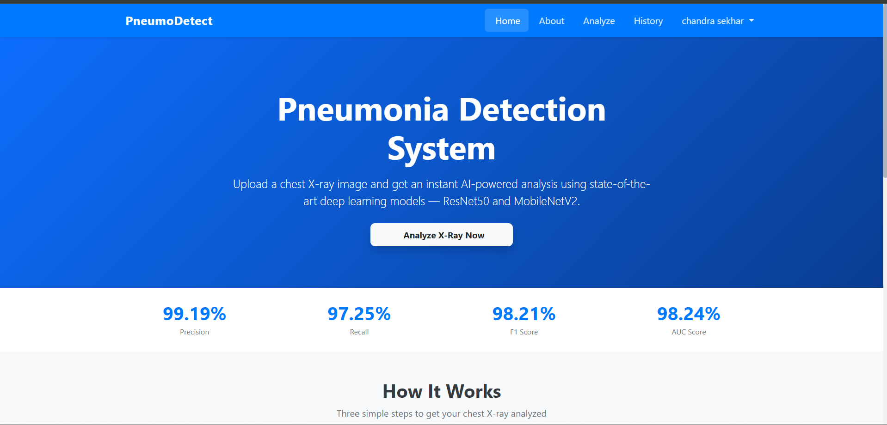
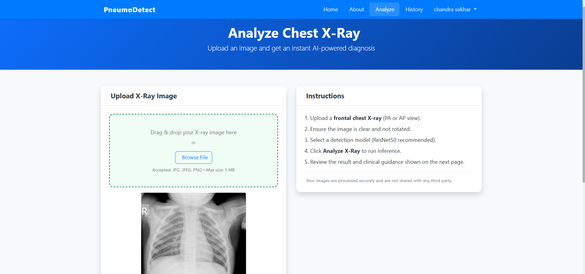
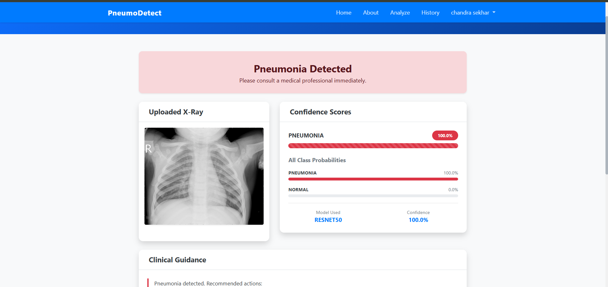
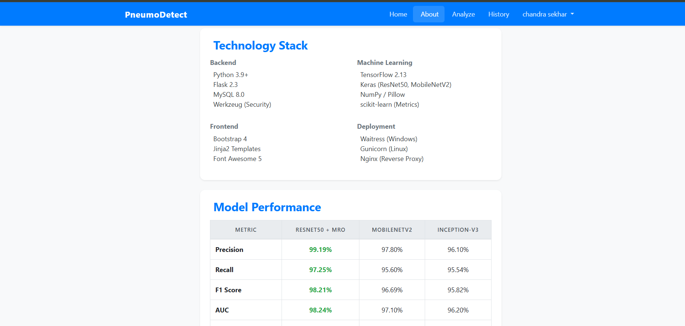

# 🫁 PneumoDetect — AI-Powered Pneumonia Detection System

<div align="center">



[](https://python.org)
[](https://flask.palletsprojects.com)
[](https://tensorflow.org)
[](https://mysql.com)
[](LICENSE)

**An end-to-end deep learning web application that detects pneumonia from chest X-ray images using state-of-the-art transfer learning models — ResNet50 & MobileNetV2.**

</div>

---

## 📊 Model Performance

| Metric | ResNet50 *(Best)* | MobileNetV2 | Inception-V3 |
|--------|:-----------------:|:-----------:|:------------:|
| **Precision** | **99.19%** | 97.80% | 96.10% |
| **Recall** | **97.25%** | 95.60% | 95.54% |
| **F1 Score** | **98.21%** | 96.69% | 95.82% |
| **AUC** | **98.24%** | 97.10% | 96.20% |

> Models trained on the [Kaggle Chest X-Ray Images (Pneumonia)](https://www.kaggle.com/datasets/paultimothymooney/chest-xray-pneumonia) dataset with class-weighted training to handle dataset imbalance.

---

## 🖼️ Screenshots

### 🏠 Home Page


### 🔬 Analyze — Upload X-Ray


### ✅ Detection Result — Pneumonia Detected


### ⚙️ Technology Stack & Model Metrics


---

## ✨ Features

- 🔍 **AI-Powered Diagnosis** — Upload a chest X-ray and get instant pneumonia detection using ResNet50 deep learning
- 📊 **Confidence Scores** — Visual probability bars for NORMAL vs PNEUMONIA with class-level breakdown
- 🩺 **Clinical Guidance** — Automated precaution recommendations based on detection result
- 🔐 **User Authentication** — Secure register/login system with hashed passwords and CSRF protection
- 📜 **Prediction History** — Every analysis is saved and accessible per user
- 📱 **Responsive UI** — Works on desktop and mobile using Bootstrap 4
- 🛡️ **Security First** — Werkzeug security, Flask-WTF CSRF, session management, input validation

---

## 🏗️ Architecture

```
pneumonia/
├── app/
│   ├── auth/               # Authentication blueprint (login, register)
│   ├── main/               # Main blueprint (home, about)
│   ├── prediction/         # Prediction blueprint (analyze, result, history)
│   │   ├── predictor.py    # ML inference engine (ResNet50 + weight loader)
│   │   └── routes.py       # Upload handling & prediction routes
│   ├── models/             # Database models (User, PredictionLog)
│   ├── static/             # CSS, JS, uploaded images
│   ├── templates/          # Jinja2 HTML templates
│   └── config.py           # App configuration
├── saved_models/           # Model weight files (not tracked in git)
├── ml/                     # Training scripts
├── database/               # SQL schema
├── deployment/             # Gunicorn / Nginx configs
├── requirements.txt
└── run.py
```

---

## 🛠️ Technology Stack

### Backend
| Technology | Version | Purpose |
|-----------|---------|---------|
| Python | 3.9+ | Core language |
| Flask | 2.3.3 | Web framework |
| MySQL | 8.0 | Database |
| Werkzeug | 2.3.7 | Security & WSGI |
| Flask-WTF | 1.1.1 | CSRF & form validation |
| Flask-Session | 0.5.0 | Server-side sessions |

### Machine Learning
| Technology | Version | Purpose |
|-----------|---------|---------|
| TensorFlow | 2.13.0 | Deep learning framework |
| Keras | (bundled) | ResNet50, MobileNetV2 |
| NumPy | 1.24.3 | Numerical computing |
| Pillow | 10.0.0 | Image preprocessing |
| scikit-learn | 1.3.0 | Metrics & evaluation |

### Frontend
- **Bootstrap 4** — Responsive layout
- **Jinja2** — Server-side templating
- **Font Awesome 5** — Icons
- **Custom CSS** — Branded UI components

### Deployment
- **Waitress** — Windows WSGI server
- **Gunicorn** — Linux WSGI server
- **Nginx** — Reverse proxy

---

## 🚀 Local Setup

### Prerequisites
- Python 3.9+
- MySQL 8.0 (XAMPP recommended for Windows)
- Git

### 1. Clone the Repository
```bash
git clone https://github.com/2124lohitharatakonda/Pneumonia-Detection-from-Chest-X-Rays.git
cd Pneumonia-Detection-from-Chest-X-Rays
```

### 2. Create Virtual Environment
```bash
python -m venv venv

# Windows
venv\Scripts\activate

# Linux/Mac
source venv/bin/activate
```

### 3. Install Dependencies
```bash
pip install -r requirements.txt
```

### 4. Configure Environment
```bash
cp .env.example .env
```
Edit `.env` with your settings:
```env
SECRET_KEY=your-secret-key-here
DB_HOST=localhost
DB_USER=root
DB_PASSWORD=
DB_NAME=pneumonia_db
ACTIVE_MODEL=resnet50
```

### 5. Setup Database
```sql
-- In MySQL / phpMyAdmin
CREATE DATABASE pneumonia_db;
```
Then import the schema:
```bash
mysql -u root pneumonia_db < database/schema.sql
```

### 6. Add Model Weights
Download the trained model weights and place in `saved_models/`:
```
saved_models/
└── resnet50_weights.h5
```

### 7. Run the Application
```bash
python run.py
```
Visit: **http://127.0.0.1:5000**

---

## 🧠 Model Details

### ResNet50 Transfer Learning
- **Base:** ResNet50 pretrained on ImageNet (frozen layers)
- **Custom Head:** GlobalAveragePooling2D → Dense(128, ReLU) → Dropout(0.4) → Dense(2, Softmax)
- **Input:** 224×224×3 RGB chest X-ray
- **Output:** [P(Pneumonia), P(Normal)]
- **Threshold:** 0.89 for PNEUMONIA classification (optimized F1)
- **Preprocessing:** ResNet50-specific ImageNet normalization

### Training Strategy
- **Dataset:** Kaggle Chest X-Ray (5,216 train / 624 test images)
- **Class Imbalance:** Handled via class weights (PNEUMONIA ~4× more common)
- **Optimizer:** Adam (lr=1e-4)
- **Callbacks:** EarlyStopping + ReduceLROnPlateau
- **Epochs:** Up to 15 (early stopping)

### Keras Version Compatibility
The inference engine includes a custom weight loader that handles **Keras 3 → Keras 2 migration** using named layer-by-layer HDF5 loading, bypassing weight-ordering incompatibilities between TF 2.20 (Colab) and TF 2.13 (local).

---

## 📁 Dataset

**Chest X-Ray Images (Pneumonia)** — Paul Mooney, Kaggle  
- **Training:** 5,216 images (1,341 NORMAL / 3,875 PNEUMONIA)
- **Testing:** 624 images (234 NORMAL / 390 PNEUMONIA)
- **Format:** JPEG chest X-rays (frontal AP/PA view)

> Dataset not included in this repo due to size. Download from [Kaggle](https://www.kaggle.com/datasets/paultimothymooney/chest-xray-pneumonia).

---

## ⚠️ Medical Disclaimer

> This application is a **screening aid only** and does **NOT** replace professional medical diagnosis. Always consult a qualified physician or radiologist for medical decisions. The AI predictions are probabilistic and may contain errors.

---

## 👨‍💻 Author

**Lohitha Ratakonda**  
GitHub: [@2124lohitharatakonda](https://github.com/2124lohitharatakonda)  
Email: lohitharatakonda.179@gmail.com

---

<div align="center">
⭐ Star this repo if you found it useful!
</div>
